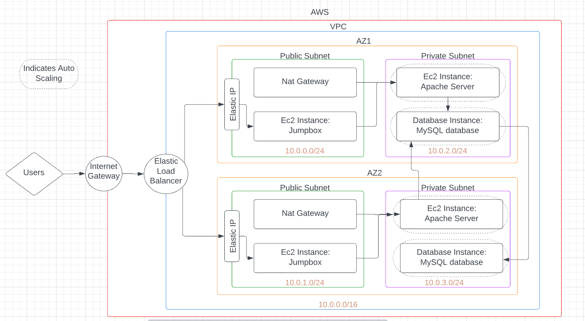

# CS4843Assignment2
## Description:
Using AWS, creates a cloud infrastructure for a web application. 
### Technologies Used:
- Amazon Web Services(AWS): Used to deploy the infrastructure
- YAML: Used to write the infrastructure as code.
- JSON: Used to write the parameters.

### Infrastructure:
AWS's Cloudformation was utilized to create the infrastructure.
Three YAML files are used to set up specific parts of the infrastructure:
- network.yaml:
    Creates:
    - A Virtual Private Cloud(VPC)
    - An internet gateway
    - Two Public and Two private subnets
    - A NAT gateway, with an elastic ip, for each public subnet
- securityAndServers.yaml:
    Creates:
    - Two EC2 instances, placed in private subnsets, that run Apache Web Server.
    - Two EC2 instances, placed in public subnsets, that are used as a jumpbox/Bastion Host.
    - A Load Balancer
    - An Auto Scaling Group
    - Security Groups for the servers and jumpboxes
- databaseAndStorage.yaml:
    Creates:
    - Two MySQL databases
    - Two EC2 Volumes

Infrastructure Layout:
- AWS Region: US West (Oregon) us-west-2
- Virtual Private Cloud(VPC): CIDR = 10.0.0.0/16
    - Load Balancer: Used to distribute incoming network traffic
    - Auto Scaling Group: Automates how groups of different resources respond to changes in demand
    - First Availablility Zone:
        - Public Subnet 1: CIDR = 10.0.0.0/24
            - Nat Gateway: Allows Private Subnet 1 egress internet access
                - Elastic IP: Gives the NAT Gatway a fixed consistent IP address. 
            - Ec2 instance: Used as a jumpbox to ssh into the private instance
        - Private Subnet 1: CIDR = 10.0.2.0/16
            - Ec2 Instance: Runs Apache Web Server
            - Database Instance: Runs a MySQL database
            - Ec2 Volume: Adds storage to the Ec2 instance
    - Second Availablility Zone:
        - Public Subnet 2: CIDR = 10.0.1.0/16
            - Nat Gateway: Allows Private Subnet 2 egress internet access
                - Elastic IP: Gives the NAT Gatway a fixed consistent IP address. 
            - Ec2 instance: Used as a jumpbox to ssh into the private instance
        - Private Subnet 2: CIDR = 10.0.3.0/16
            - Ec2 Instance: Runs Apache Web Server
            - Database Instance: Runs a MySQL database
            - Ec2 Volume: Adds storage to the Ec2 instance

### Delpoying the Infrastructure:
In an AWS CLI, enter these commands one by one in the order given: 
Note: Before entering the commands, make sure your are in the same directory as the files.
1. aws cloudformation create-stack --stack-name network --template-body file://network.yaml --parameters file://networkParams.json
2. aws cloudformation create-stack --stack-name serversAndSecurity --template-body file://securityAndServers.yaml --parameters file://securityAndServersParams.json
3. aws cloudformation create-stack --stack-name databaseAndStorage --template-body file://databaseAndStorage.yaml --parameters file://databaseAndStorageParams.json
